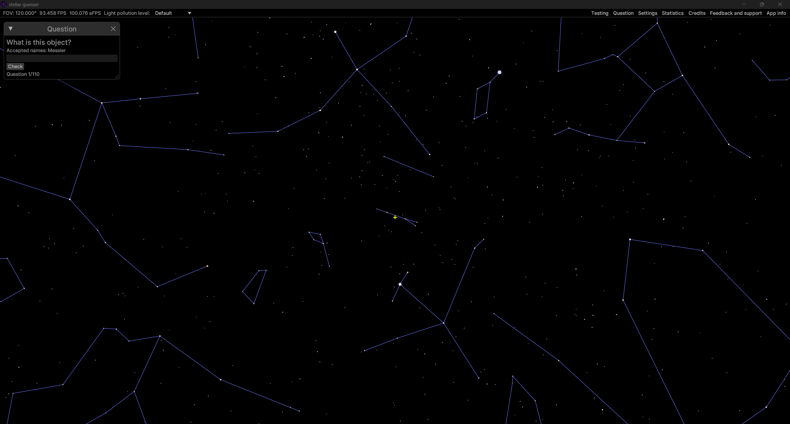
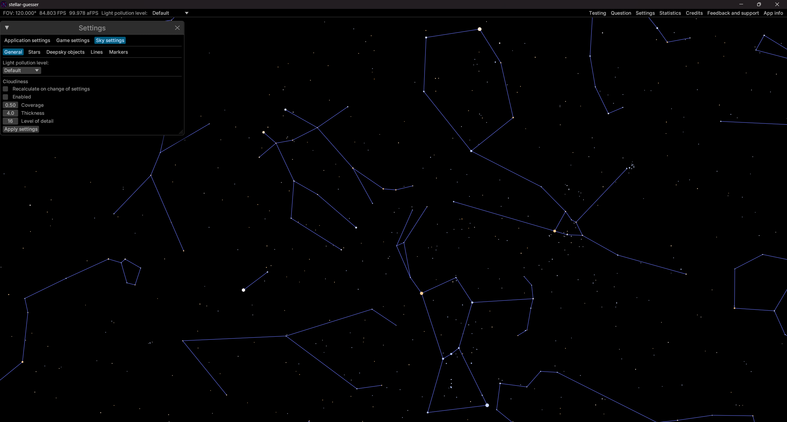
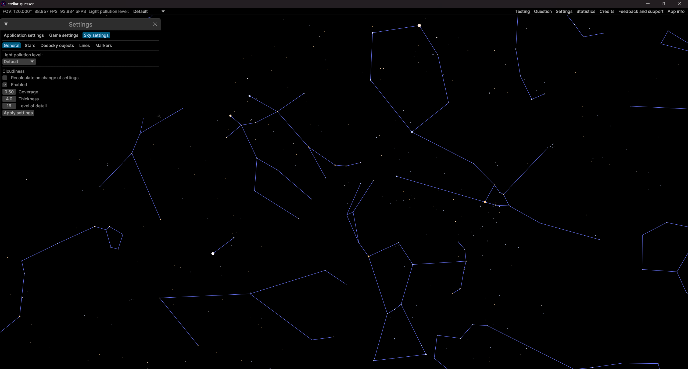

# Stellar Guesser
Stellar Guesser was developed as a tool for learning the night sky in a game-like manner. The default question packs provide a learning path from the very basics to knowledge suitable for contestants aiming to win a gold medal at the IOAA. It is also possible to create custom question packs for a personalised learning experience. There is a large selection of question types, which can for example test your knowledge of deep-sky objects, star designations, constellation borders or focus on skills such as estimating coordinates, distances between objects, magnitudes of stars or identifying missing stars.  
Regarding olympiad preparation, the application covers the vast majority of the factual knowledge required for the practical rounds at the IOAA – sky map, planetarium, and telescopes. Of course, there is more to those rounds than just knowing a lot of information, for example being able to point a telescope and some tasks being more focused on measurements. However, being able to find your way around the night sky is usually crucial, or at least very helpful.

## Screenshots
<figure>
    
    <figcaption>A game screen asking the player to identify the marked object</figcaption>
</figure>

<figure>
    
    <figcaption>A game screen with no cloud coverage</figcaption>
</figure>

<figure>
    
    <figcaption>A game screen with part of stars obscured by stars</figcaption>
</figure>